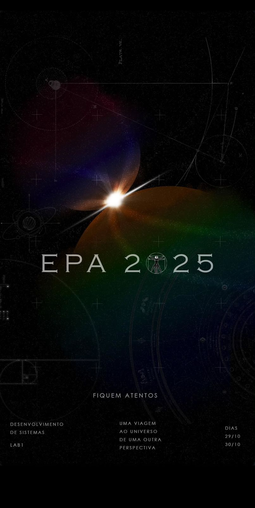
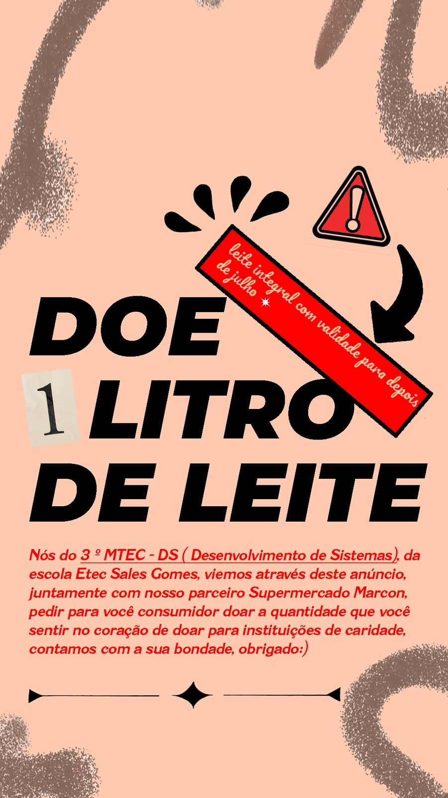
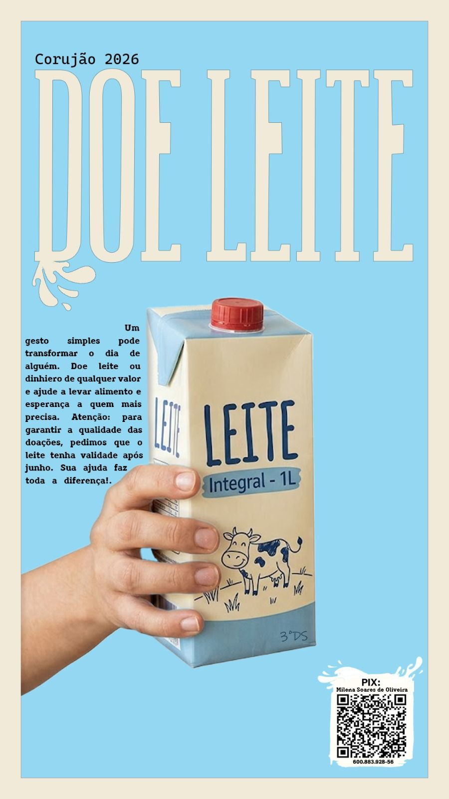
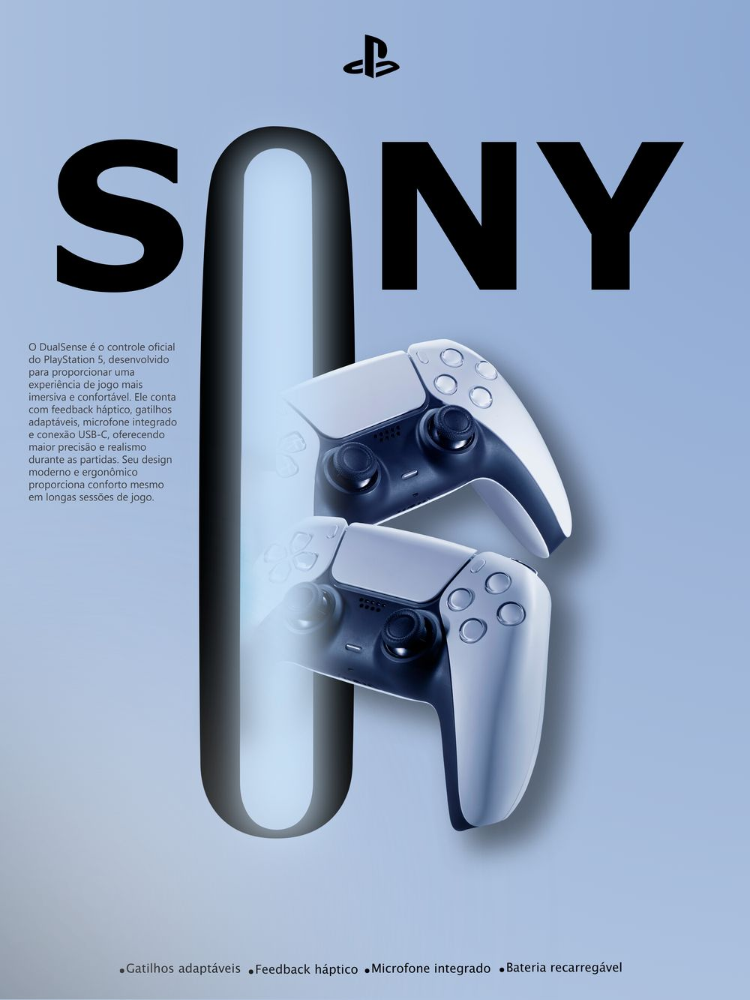
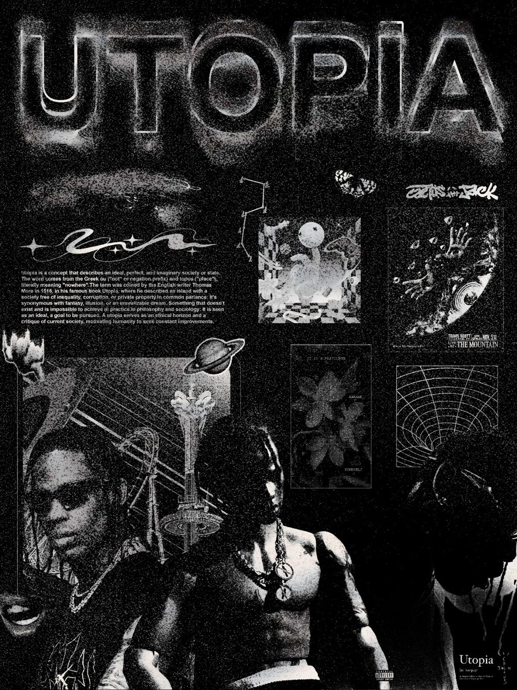
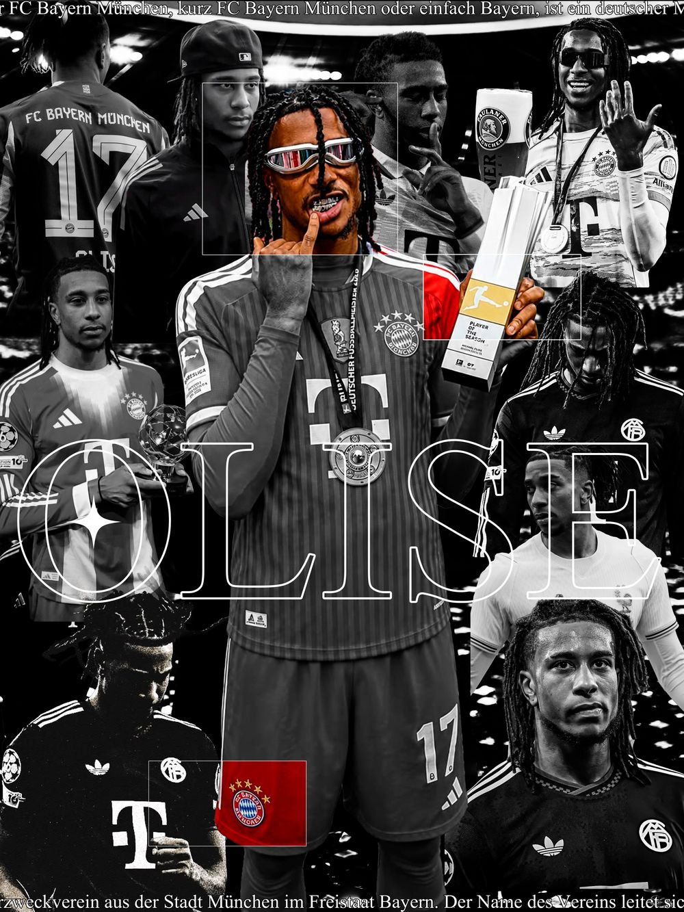
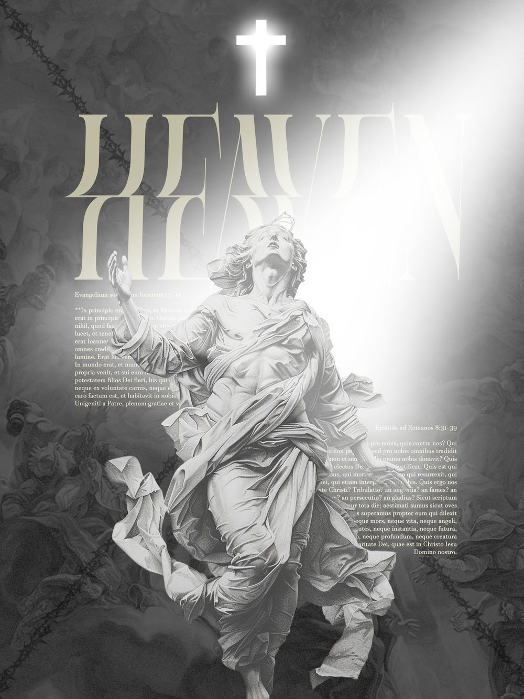

<h1 align="center">RHYAN SMELLO — PORTFÓLIO</h1>

<p align="center">
  Site de portfólio de designer gráfico.<br>
  HTML, CSS e JavaScript puros. Sem framework, sem build, sem <code>node_modules</code>.
</p>

<p align="center">
  <a href="#como-rodar">Como rodar</a> ·
  <a href="#onde-mexer">Onde mexer</a> ·
  <a href="#sistema-visual">Sistema visual</a> ·
  <a href="#publicar-no-github-pages">Publicar</a> ·
  <a href="#direitos">Direitos</a>
</p>

---

## Trabalhos no site

<table>
  <tr>
    <td width="25%"></td>
    <td width="25%"></td>
    <td width="25%"></td>
    <td width="25%"></td>
  </tr>
  <tr>
    <td align="center"><b>EPA 2025</b><br><sub>Direção de arte</sub></td>
    <td align="center"><b>ETEC 90 ANOS</b><br><sub>Eventos</sub></td>
    <td align="center"><b>DOE 1 LITRO</b><br><sub>Publicidade</sub></td>
    <td align="center"><b>CORUJÃO 2026</b><br><sub>Publicidade</sub></td>
  </tr>
  <tr>
    <td></td>
    <td></td>
    <td></td>
    <td></td>
  </tr>
  <tr>
    <td align="center"><b>SONY DUALSENSE</b><br><sub>Conceitual</sub></td>
    <td align="center"><b>UTOPIA</b><br><sub>Autoral</sub></td>
    <td align="center"><b>OLISE</b><br><sub>Autoral</sub></td>
    <td align="center"><b>HEAVEN</b><br><sub>Autoral</sub></td>
  </tr>
</table>

> Um print da página inteira ficaria bom logo acima desta seção. Para gerar:
> abra o site, `F12` → `Ctrl+Shift+P` → digite **"screenshot"** → *Capture full size
> screenshot*. Salve como `assets/preview.jpg` e adicione a linha
> `` acima desta seção.

---

## Sobre o projeto

O site foi construído para ser, ele mesmo, uma peça do portfólio — a interface
usa a mesma linguagem gráfica das artes que ela apresenta: contorno preto,
sombra dura sem desfoque, papel quadriculado, composição de colagem e letras
recortadas ao estilo bilhete de resgate.

Três decisões que valem explicação:

**Sem framework.** É um site estático de nove seções. React ou Next.js aqui
adicionariam etapa de build, dependências para manter e peso de runtime sem
resolver nenhum problema que o projeto tenha. Abrir o `index.html` no navegador
já mostra o site pronto.

**Mural em colunas, não em grade.** Os cartazes têm proporções diferentes —
3:4, 9:16 e 5:9. Uma grade de proporção fixa cortaria cabeçalho ou rodapé de
quase todos. As colunas com quebra natural (`columns` + `break-inside: avoid`)
deixam cada peça aparecer inteira e produzem alturas irregulares, que é o efeito
de mural pretendido.

**Animação com freio.** Há cursor customizado, entrada no scroll, inclinação no
hover e faixas em movimento — mas todos desligam sozinhos em
`prefers-reduced-motion`, e o cursor some em telas de toque. Nenhuma animação
depende de biblioteca.

---

## Como rodar

Abra a pasta no VS Code e clique em **Go Live** (extensão
[Live Server](https://marketplace.visualstudio.com/items?itemName=ritwickdey.LiveServer)).

Ou abra o `index.html` direto no navegador — funciona igual, sem servidor.

Não existe `npm install`. Não existe passo de build.

---

## Estrutura

```
rhyan-portfolio/
├── index.html          Conteúdo de todas as seções + SVGs dos stickers
├── css/
│   └── style.css       Sistema visual inteiro (tokens no :root, no topo)
├── js/
│   └── main.js         Modal de projeto, cursor, reveal, habilidades
├── assets/
│   ├── foto.jpg        Retrato da seção Sobre
│   └── *.jpg           As oito artes
├── .gitignore
└── README.md
```

Três arquivos de código. Nenhuma dependência instalada.

---

## Onde mexer

| O que mudar | Arquivo | Onde exatamente |
|---|---|---|
| Cores | `css/style.css` | bloco `:root`, primeiras linhas |
| Fontes | `css/style.css` + `index.html` | variáveis `--f-*` e o `<link>` do Google Fonts |
| Textos das seções | `index.html` | direto no HTML |
| Foto do Sobre | `assets/foto.jpg` | substitua o arquivo, mantendo o nome |
| Arte de um projeto | `index.html` | `src` dentro de `<span class="p-art">` |
| Texto do modal | `js/main.js` | array `P` |
| Habilidades de design | `js/main.js` | array `SK` |
| Tecnologias (Front/Back/Dados/Ops) | `index.html` | seção `#dev`, blocos `<span class="tech">` |
| Texto da VFA | `index.html` | seção `#dev` — é HTML direto, não passa pelo `js` |
| Paleta da zona dev | `css/style.css` | bloco `.devzone{...}`, variáveis `--d-*` |
| Telefone e e-mail | `index.html` | seção `#contato` — aparecem 2× cada |
| Frases dos stickers | `index.html` | `<span class="float …">` no hero |

### Adicionar um projeto novo

> A VFA **não** está no mural. Ela tem seção própria (`#dev`), escrita em HTML
> direto, porque um projeto de sistema precisa de diagrama, tabela de arquitetura
> e stack — coisas que não cabem num card de cartaz.

1. Coloque a arte em `assets/`, com no máximo **1000px de largura** e qualidade
   **80**. É o que mantém o carregamento rápido.
2. No `index.html`, duplique um bloco `<button class="proj rv" data-p="N">` e
   ajuste: `data-p` para o próximo número da sequência, `src`, `alt`, título,
   categoria, descrição, ano e tags.
3. No `js/main.js`, acrescente o objeto correspondente **no fim do array `P`**,
   na mesma ordem do `data-p`.

O `data-p` é o índice do array. Se os dois saírem de sincronia, o modal abre o
projeto errado — é o único ponto do código onde isso pode acontecer.

Para os projetos autorais, o processo é o mesmo dentro de `<div class="rail">`,
só que sem modal.

---

## Sistema visual

Tudo sai de variáveis CSS no `:root`. Trocar a paleta inteira do site é editar
seis linhas.

### Cores

| Token | Hex | Uso |
|---|---|---|
| `--rosa` | `#EF3D7A` | acento principal, mascote, destaques |
| `--azul` | `#2657E8` | botões secundários, faixa |
| `--amarelo` | `#FFC22B` | marca-texto, fita, etiquetas |
| `--verde` | `#2FA84F` | botão principal |
| `--laranja` | `#F4501E` | acentos pontuais |
| `--lilas` | `#B688F0` | acentos pontuais |
| `--line` | `#17120E` | contorno e sombra dura — inverte no tema escuro |
| `--paper` | `#EDE9DF` | fundo com quadriculado impresso |

### Tipografia

| Token | Fonte | Papel |
|---|---|---|
| `--f-fat` | Shrikhand | títulos de seção e nomes de projeto |
| `--f-sign` | Bungee | etiquetas, botões, menu, faixas |
| `--f-serif` | Instrument Serif | itálicos editoriais e citações |
| `--f-mono` | Rubik Mono One | números e acentos tipográficos |
| `--f-body` | Archivo | texto corrido e interface |
| `--f-code` | JetBrains Mono | toda a zona dev: títulos, rótulos e nomes de função |

As cinco vêm do Google Fonts — a **única** requisição externa do site. Se o
carregamento falhar, cada uma cai para uma pilha de fallback declarada, com
famílias visualmente distintas entre si, então o efeito de letras recortadas
não desaparece por completo.

### A zona dev

A partir da faixa `> encerrando modo_design`, o site troca de linguagem visual de
propósito: fundo escuro, contorno de 1px no lugar da sombra dura, tipografia
monoespaçada e cantos marcados nos painéis. O menu acompanha, via
`IntersectionObserver` em `js/main.js`.

A paleta não é "cyberpunk genérico" — são as cores do `globals.css` do próprio
sistema VFA (`#00E08F`, `#070B12`, `#1E6BFF`). Elas vivem em `--d-*`, escopadas
dentro de `.devzone`, e **não** respondem ao tema claro/escuro: a zona é um
ambiente fixo, não um tema.

| Token | Hex | Uso |
|---|---|---|
| `--d-bg` | `#070B12` | fundo da zona |
| `--d-surface` | `#0E141F` | painéis e tabelas |
| `--d-line` | `#1C2534` | bordas e grade |
| `--d-acc` | `#00E08F` | acento principal, cantos, links |
| `--d-acc2` | `#1E6BFF` | acento secundário, caches, decisões |

### Tema claro e escuro

O site responde às três situações possíveis: escolha explícita de claro,
escolha explícita de escuro e o padrão "sistema". No escuro, o contorno inverte
de preto para papel — os stickers viram desenho a giz em vez de sumirem no
fundo. As cores vibrantes são as mesmas nos dois temas.

---

## Acessibilidade e desempenho

- Testado de **400px a 1280px**, sem rolagem horizontal em nenhuma largura.
- Navegação completa por teclado, com foco visível de 4px em todos os controles.
- `prefers-reduced-motion` desliga cursor, faixas, flutuações e entradas.
- `lang="pt-BR"`, texto alternativo descritivo em todas as imagens, `aria-label`
  nas letras recortadas do hero (que são spans separados e ficariam ilegíveis
  para leitor de tela).
- Modal fecha com `Esc`, com clique fora e devolve o foco ao card de origem.
- Imagens dos projetos com `loading="lazy"` e dimensões declaradas, para não
  haver salto de layout durante o carregamento.
- Zero JavaScript de terceiros. Zero rastreador. Zero cookie.

---

## Publicar no GitHub Pages

1. Repositório → **Settings** → **Pages**
2. *Source*: **Deploy from a branch**
3. Branch `main`, pasta `/ (root)` → **Save**

Em cerca de um minuto o site fica em
`https://SEU-USUARIO.github.io/rhyan-portfolio/`.

Como não há build, o que está no repositório é exatamente o que vai ao ar.

---

## Direitos

**As artes em `assets/` são obras minhas** e não estão liberadas para reuso.
Estão neste repositório porque são o conteúdo do portfólio, não porque são
material livre.

**O código** (`index.html`, `css/`, `js/`) pode ser lido e estudado à vontade.

> ⚠️ **Não adicione um `LICENSE` de MIT neste repositório sem pensar.** Uma
> licença permissiva vale para o repositório inteiro, incluindo `assets/` — ou
> seja, licenciaria as suas artes para qualquer um reutilizar comercialmente.
> Se quiser licenciar, licencie o código e deixe as imagens de fora,
> explicitamente.

**Peças conceituais:** `SONY DUALSENSE`, `UTOPIA`, `OLISE` e `HEAVEN` usam
marcas, obras e pessoas reais em trabalho de fã ou exercício de estudo. Não são
material oficial nem foram encomendadas por essas marcas. O site marca isso —
mantenha a marcação.

---

## Contato

**Rhyan Smello** — designer gráfico, Tatuí/SP

[WhatsApp 15 99722-9399](https://wa.me/5515997229399) · [rhyansmello@gmail.com](mailto:rhyansmello@gmail.com)

<sub>© 2026 Rhyan Smello — feito com café demais e ideias demais.</sub>
